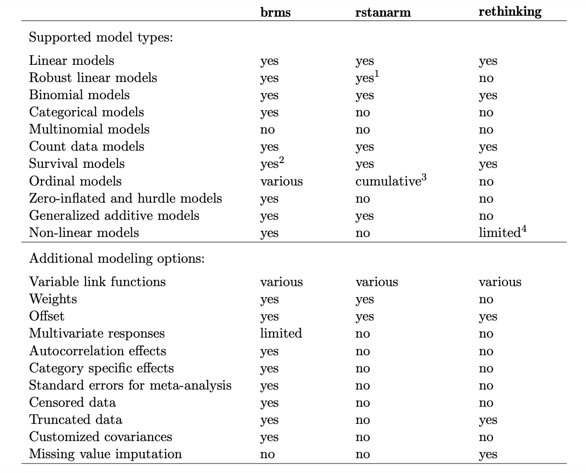

# What I plan to cover: 
**Heads Up!!** This will be application focused and not an in-depth explanation of Bayesian statistics
- Key differences between Frequentist and Bayesian approaches
- How do we implement Bayesian models in R?
- What is a hierarchical model anyways?
- Resources for further reading

```{r setup, include=FALSE}
options(htmltools.dir.version = FALSE)
knitr::opts_chunk$set(fig.retina=3)

```
<!--
- Compile from command-line
Rscript -e "knitr::knit('brms_tutorial_feb5.Rmd', tangle=TRUE)"
-->

```{r pack, message=FALSE}
library(tidyverse)
library(brms)
library(tidybayes)
```


<!--
- Compile from command-line
Rscript -e "knitr::knit('r_ladies_ggplot_nov.Rmd', tangle=TRUE)"
-->


---
# Linear regression
$$
y= \beta_0 + \beta_1x +\epsilon
$$
Let's simulate some data: 
```{r lm1}
nrep = 100
b0 = 5
b1 = -2
sd = 2

set.seed(123)
sim.data <- tibble(X = rnorm(nrep, 0, 1)) %>% 
  mutate(eps = rnorm(n = nrep, mean = 0, sd = sd),
         Y = b0 + b1*X + eps)

kableExtra::kable(head(sim.data))
```

---
# Linear regression

```{r lm1-plot, fig.height=5, fig.width=8}
ggplot(sim.data, aes(X, Y)) +
  geom_point() +
  geom_smooth(method='lm') +
  theme_test()
```

---
# Linear regression
### Frequentist (OLS)
### function(Response ~ predictor, data)
```{r ols1}
f1.1 <- lm(Y~X, data=sim.data) 
summary(f1.1)

```

---
# Linear regression
From OLS we obtain **point estimates** of our parameters

From Bayesian analysis we obtain probability distributions or the **posterior** because of Bayes' rule:

$$
P(\theta|data) = \frac{P(data|\theta) \times P(\theta)}{P(data)}
$$
Or: 

$$
Posterior \propto Likelihood \times Prior
$$
--
This is often an analytically intractable problem so we use algorithms for sampling from a probability distribution. **MCMC** is a popular one **HMC** converge more rapidly. There are many software implementations of these algorithms. 

Here I will focus on the R package **'brms'** which uses the program **Stan** in the background 

---
# Installing brms and Stan

```{r pack2, eval=F}
install.packages("brms")
```

--
###Did anyone have problems?

---
# Bayesian Linear regression
### Response ~ predictor

Remember frequentist implementation:
```{r ols1-revisit}
f1.1 <- lm(Y~X, data=sim.data) 
```

--
Look similar?

```{r brm1, eval=F}
b1.1 <- brm(Y~X, data=sim.data,
          chains=4, iter=2000, cores=4) 

saveRDS(b1.1, "saved models/b1.1.rds") ## if you want to save your model and come back to it
```
```{r brm1 cont}
b1.1 <- readRDS("saved models/b1.1.rds") ## load your saved model
```
R may seem slow at first because the model is being compiled to C++ via Stan, sampling will start momentarily.

---
# Linear regression
### Bayesian
Our output looks a little different than our OLS output
```{r brm1-out}
summary(b1.1)
```

---
# What just happened?
```{r stan}
stancode(b1.1)
```

---
# Did we recover our true parameters?
```{r params1, echo=F, fig.height=5, fig.width=8}
trueparams <- tibble(var= c("b0", "b1", "sd"),
                     value= c(5, -2, 2))

fparams <- broom::tidy(f1.1, conf.int = TRUE) %>% 
  bind_rows(tibble(term="resid_sd", estimate=summary(f1.1)$sigma)) %>% 
  mutate(var=c("b0", "b1", "sd"))

bparams <- gather_draws(b1.1, b_Intercept, b_X, sigma) %>% 
  median_qi() %>% 
  mutate(var=c("b0", "b1", "sd"))

ggplot() +
  geom_point(data=trueparams, aes(var, value), size=3) +
  geom_point(data=fparams, aes(var, estimate), color="red", position = position_nudge(x=0.1), size=3) +
  geom_linerange(data=fparams, aes(var, ymin = conf.low, ymax=conf.high), color="red", position = position_nudge(x=0.1)) +
  geom_point(data=bparams, aes(var, .value), color="blue", position = position_nudge(x=0.2), size=3) +
  geom_linerange(data=bparams, aes(var, ymin=.lower, ymax=.upper), color="blue", position = position_nudge(x=0.2)) +
  theme_test() +
  xlab("Variable") + ylab("Value") 

```

---
# Here's another look at the posterior
plus a quick look at what you can do with tidybayes
```{r post, fig.height=5, fig.width=8}
tidybayes::gather_draws(b1.1, b_Intercept, b_X, sigma) %>% 
  ggplot(aes(x=.value, y=.variable)) +
  stat_halfeye(.width = c(.90, .5)) +
  theme_test() +
  xlab("Variable") + ylab("Value") 
```

---
# Just for fun
try playing around with all of the posterior draws and variables for this super simple model to try and get an appreciation of what the few lines of code from the slide before do. 
```{r mcmc}
draws <- as.mcmc(b1.1, combine_chains = T) ## I combined the chains but you can keep them separate
dim(draws)
```

---
# Model diagnostics
### Traceplots
```{r b1.1-trace, fig.height=5, fig.width=8}
plot(b1.1)
```

---
# Model diagnostics
### Visual posterior predictive checks
```{r b1.1-pp, fig.height=5, fig.width=8}
pp_check(b1.1)
```

---
# A bit about priors
Brms sets default priors, but you can easily specify exactly what you want. 
```{r prior1}
prior_summary(b1.1)
```

```{r prior2, eval=F}

prior1 <- prior(normal(-2,0.1), class=b)
# make_stancode(Y~0 + Intercept + X, data=sim.data, prior=prior1, family = gaussian)

b1.2 <- brm(Y~X, data=sim.data, prior=prior1,
          chains=4, iter=2000, cores=4) 
saveRDS(b1.2, "saved models/b1.2.rds")

```
```{r prior3}
b1.2 <- readRDS("saved models/b1.2.rds")
```
---
# Priors continued
```{r prior4, fig.height=5, fig.width=8, echo=F}
bparams2 <- gather_draws(b1.2, b_Intercept, b_X, sigma) %>% 
  median_qi() %>% 
  mutate(var=c("b0", "b1", "sd"))

ggplot() +
  geom_point(data=trueparams, aes(var, value), size=3) +
  geom_point(data=bparams, aes(var, .value), color="blue", position = position_nudge(x=0.2), size=3) +
  geom_linerange(data=bparams, aes(var, ymin=.lower, ymax=.upper), color="blue", position = position_nudge(x=0.2)) +
  geom_point(data=bparams2, aes(var, .value), color="blue", position = position_nudge(x=0.3), size=3) +
  geom_linerange(data=bparams2, aes(var, ymin=.lower, ymax=.upper), color="blue", position = position_nudge(x=0.3)) +
  theme_test() +
  xlab("Variable") + ylab("Value") +
  ggtitle("Flat priors vs informative priors on b1")
```

---
# Hierarchical (grouped) data
Lets simulate some new data with records for different groups. Here I'm simulating data for groups that pretty high data representation (n=50).

```{r data2}
ngroup = 10
group_rep = rep(50, ngroup)

mu_b0 = 5 ## mean of distribution from which plot level intercepts will be drawn
sd_b0 = 0.4 ## sd of distribution from which plot level intercepts will be drawn
b1 = -2 ## slope
sd = .8 ## residual sd

set.seed(123)
params <- tibble(group = LETTERS[seq( from = 1, to = ngroup)],
                 b0 = rnorm(ngroup, mu_b0, sd_b0),
                 nrep=group_rep) 

set.seed(123)
sim.data <- params %>% 
  expand_grid(group_n = 1:max(group_rep)) %>% 
  mutate(X = rnorm(sum(group_rep), 0, 1),
         eps = rnorm(n = sum(group_rep), mean = 0, sd = sd),
         Y = b0 + b1*X + eps)
```

---
# Hierarchical (grouped) data
```{r dataplot, fig.height=5, fig.width=8, echo=F}
ggplot(sim.data, aes(x=X, y=Y, color=group)) +
  geom_point() +
  geom_smooth(method='lm') +
  theme_test() +
  ggtitle("Simulated data")
```

---
# No pooling
There are a few approaches one could take. Here in this case we might be more interested in the relationship between X and Y, but we know that grouping will likely have some effect. First we will take a look at what happens when we treat each plot as independent (fixed effect is one way to think about this),

```{r b2.1, eval=F}
b2.1 <- brm(Y ~ X + group, data=sim.data,
            chains=4, iter=2000, cores=4)

saveRDS(b2.1, "saved models/b2.1.rds") 
```
```{r b2.1b, echo=F}
b2.1 <- readRDS("saved models/b2.1.rds")
```

---
# No pooling
```{r nopool}
summary(b2.1)
```

---
# Complete pooling
But what if we're more interested in the general relationship between X and Y for an average group? What happens when we ignore the group?
```{r b2.2, eval=F}
b2.2 <- brm(Y ~ X , data=sim.data,
            chains=4, iter=2000, cores=4)

saveRDS(b2.2, "saved models/b2.2.rds") 
```
```{r b2.2b, echo=F}
b2.2 <- readRDS("saved models/b2.2.rds")
```

```{r pool}
summary(b2.2)
```

---
# Partial pooling
### Response ~ pterms + (gterms|group)
```{r b2.3, eval=F}
b2.3 <- brm(Y ~ X + (1|group), data=sim.data,
            chains=4, iter=2000, cores=4)

saveRDS(b2.3, "saved models/b2.3.rds") 
```
```{r b2.3b, echo=F}
b2.3 <- readRDS("saved models/b2.3.rds")
```

```{r ppool}
summary(b2.3)
```

---
# No pooling versus partial pooling
```{r compare, echo=F, fig.height=5, fig.width=8, message=F}
np_params <- spread_draws(b2.1, `b_.*`, regex=T) %>% 
  mutate_at(vars(starts_with("b_group")), ~(. + b_Intercept)) %>% 
  rename(b_groupA=b_Intercept) %>% 
  pivot_longer(cols = -c(.chain, .iteration,.draw), names_to="param", values_to = "estimate") %>% 
  group_by(param) %>% 
  median_qi() %>% 
  mutate(group=str_sub(param, start=-1)) %>% 
  left_join(params) %>% 
  filter(group!="X")

pp_params <- spread_draws(b2.3, b_Intercept, r_group[group, term]) %>% 
  median_qi(Int=b_Intercept,
            est_b0=b_Intercept + r_group) %>% 
  right_join(params)

ggplot(pp_params, aes(y = group, x = est_b0, xmin = est_b0.lower, xmax = est_b0.upper)) +
  geom_pointinterval(color="blue") +
  geom_pointinterval(data=np_params, aes(y = group, x = estimate, xmin = .lower, xmax = .upper), position = position_nudge(y=-0.2)) +
  geom_point(aes(y=group, x=b0), color="red")
  
```
---
# Model selection and weighting
```{r waic}
# compute and save the WAIC information for the next three models
b2.1 <- add_criterion(b2.1, "waic")
b2.2 <- add_criterion(b2.2, "waic")
b2.3 <- add_criterion(b2.3, "waic")

# compare the WAIC estimates
w <- loo_compare(b2.1, b2.2, b2.3,
                 criterion = "waic")

cbind(waic_diff = w[, 1] * -2,
      se        = w[, 2] * 2)

model_weights(b2.1, b2.2, b2.3, 
              weights = "waic")  %>% 
  round(digits = 2)
```
---
# Posterior predictions
```{r post-pred, fig.height=4, fig.width=8}
set.seed(123)
newdata <- data.frame(
  X = 0)

ppred <- add_predicted_draws(newdata, b2.3, re_formula = NA, allow_new_levels=T) %>% 
  mutate(model="pp") %>% 
  bind_rows(add_predicted_draws(newdata, b2.2) %>% mutate(model="cp") )

ggplot(ppred) +
  geom_density(aes(.prediction, color=model)) + 
  theme_test()
  
```


---
# This is the tip of the iceberg
```{r, echo=FALSE}

```

---
# Additional resources
[Multiple brms vignettes](https://cran.r-project.org/web/packages/brms/index.html) 

[More tidybayes info](http://mjskay.github.io/tidybayes/)

[Statistical rethinking recoded](https://bookdown.org/ajkurz/Statistical_Rethinking_recoded/)

[A really approachable MLM paper](https://doi.org/10.1044/2018_JSLHR-S-18-0006)

